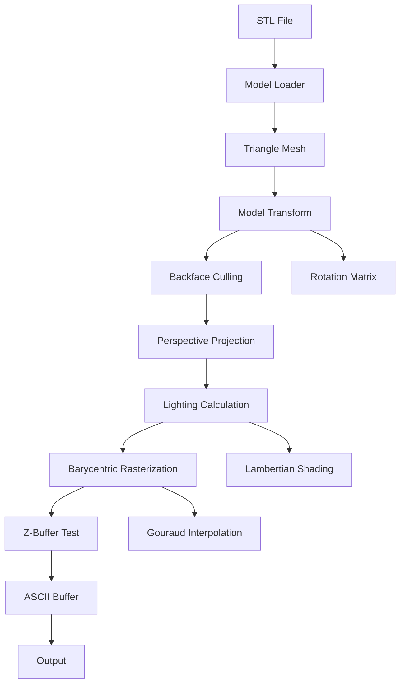

# Architecture

## Pipeline Overview



## Data Flow

1. **Model Loading**: STL → `Triangle` mesh
2. **Transform**: Apply rotation matrix $R$ to vertices and normals
3. **Culling**: Reject back-facing triangles via dot product
4. **Projection**: 3D → 2D using perspective transform
5. **Lighting**: Per-vertex intensity via $\mathbf{n} \cdot \mathbf{l}$
6. **Rasterization**: Barycentric interpolation with z-buffer
7. **Output**: Character buffer → terminal/WASM

## Module Dependencies

```
math3d (no deps)
  ↓
model, projection, lighting, rasterizer
  ↓
renderer
```

